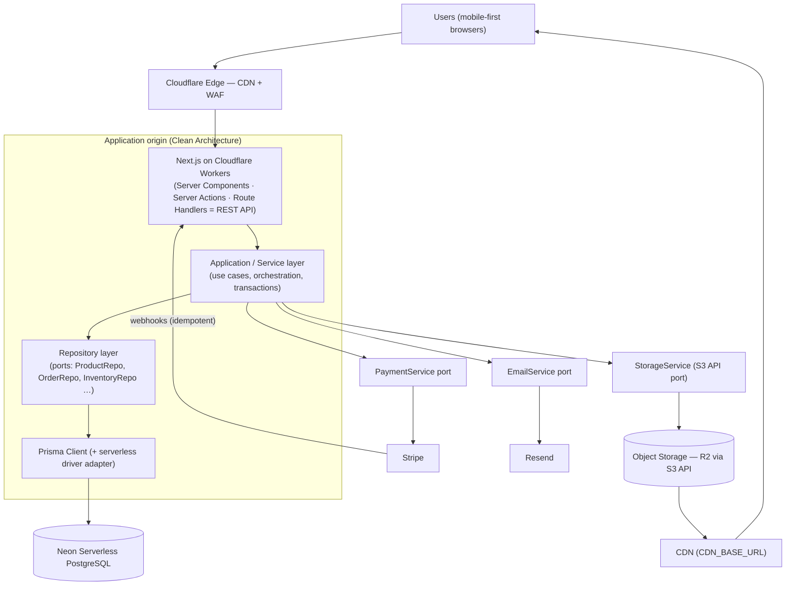
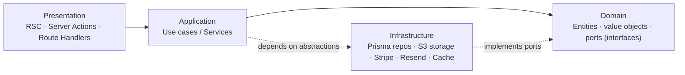

# System Architecture — Aheed Online Store

**Status:** Approved architecture baseline. Supersedes the GCP-origin design in the original
ADR-001. This document is the technical source of truth for infrastructure and layering; it is
governed by the SDD constitution (propose → spec → validate → changelog).

**Design goal:** a **PostgreSQL-first, vendor-agnostic, cost-effective** cloud-native storefront.
Every external dependency (compute, database, object storage, payments, email) sits behind an
environment-configured seam so the platform can move clouds without a rewrite.

> Related decisions: `decisions/ADR-001-hosting.md` (revised — Cloudflare + Neon),
> `decisions/ADR-002-auth-library.md` (unchanged — Better Auth),
> `decisions/ADR-003-storage-abstraction.md` (new — S3-compatible storage port).

---

## 1. Updated Technology Stack

| Concern | Choice | Portability seam |
|---|---|---|
| Web + API | **Next.js (App Router, TypeScript)** on **Cloudflare** (Pages/Workers via the OpenNext adapter) | Framework-standard; API is plain route handlers + Server Actions. Origin can move to Node/containers unchanged. |
| Database | **Neon Serverless PostgreSQL** | Standard Postgres wire protocol. `DATABASE_URL` / `DIRECT_URL` only. |
| ORM | **Prisma** (with driver adapter for the serverless/edge connection) | Schema + queries are provider-neutral Postgres. Adapter is the only swap point. |
| Object storage | **Cloudflare R2**, accessed **only via the S3-compatible API** (AWS SDK v3 S3 client) | `StorageService` port; `S3_*` env vars. No R2-specific SDK or feature. |
| Image delivery | CDN in front of the bucket | DB stores **relative keys**; `CDN_BASE_URL` resolved at runtime. |
| Payments | **Stripe** (Elements/Checkout + webhooks) | `PaymentService` port; card data never touches our servers. |
| Transactional email | **Resend** | `EmailService` port; swappable for SES/SendGrid. |
| Auth | **Better Auth** (self-hosted, bearer tokens, RBAC) | Unchanged from ADR-002. |
| Validation | **zod** (shared client/server, plus env parsing) | — |
| Caching | Next.js Data/Route cache (portable) + optional edge KV behind a `CacheService` port | Degrades to DB-only; KV ↔ Redis swap. |

**Cost posture:** Neon and R2 both scale to (near) zero when idle; Workers bill per request; R2 has
**zero egress**. At the MVP's scale this is a low fixed-cost footprint with no idle compute bill.

---

## 2. System Architecture Diagram

### 2.1 Request / data flow



### 2.2 Layering (Dependency Inversion — arrows point inward)



The **domain and application layers know nothing about Neon, R2, Cloudflare, or Stripe.** They
depend on ports (interfaces). Infrastructure supplies implementations, wired at the composition
root. That inversion is what makes the migrations in §4 mechanical.

**Strict flow (enforced in review):**
`Users → Next.js (Cloudflare) → Backend (Server Actions/Route Handlers) → Service → Repository → Prisma → Neon + Object Storage + Stripe.`
No layer skips inward; components never touch Prisma or the S3 client directly.

---

## 3. Database Design Approach

### 3.1 Modelling rules

- **Strict relational / 3NF.** Every entity is a typed table with explicit foreign keys. **No
  `Json` columns, no document blobs, no key-value bags** for domain data.
- **No raw SQL in application code.** All access goes through Prisma's typed query API. (DDL for
  indexes lives in migrations, which is standard portable SQL, not application queries.)
- **Provider-neutral types only.** Integers, `text`/`varchar`, `boolean`, `timestamptz`, `numeric`,
  Prisma enums (compile to standard Postgres enums), `uuid`. **No** `money`, no Neon/RDS-specific
  extensions in the hot path. `citext`/`pg_trgm` are optional and only via portable migrations.
  **`pg_trgm` is now actually installed** (P7.5d+e, #163, migration
  `20260820143949_p7_5de_order_search_trigram`) — the first extension this database has ever
  carried, and still provider-neutral: `pg_trgm` is a stock contrib module, not a Neon feature.
  It backs three GIN trigram indexes (`Order.orderNumber`, `Order.guestEmail`, `User.email`) that
  make the staff order search's leading-wildcard `ILIKE` servable; no B-tree can do that, which is
  why the indexes could not simply be `@@index` declarations.
  **Standing consequence:** Prisma's schema language cannot express an index's access method or
  operator class, so `schema.prisma` no longer fully describes the database. `prisma migrate diff`
  may report drift that is not drift, and `prisma migrate dev` may propose **dropping** these
  indexes — keep them and re-assert the migration. This is the first exercise of the
  hand-authored-DDL exception ruled on in P7d (#218); the migration carries the disclosure that
  ruling requires.
- **Money as integer minor units (pence).** Currency stored explicitly (`GBP` default). Avoids
  float drift and locale-bound types.
- **Images/large files never in the DB.** Only a **relative storage key** (e.g.
  `products/{productId}/{uuid}.webp`). Full URL is composed at read time from `CDN_BASE_URL`.
- **Historical snapshots are intentional.** `OrderItem` stores name + unit price at purchase time —
  a recorded fact, not a normalization breach.

### 3.2 Core schema (representative Prisma excerpt)

> **Multi-tenancy (ADR-004, slice 1 — `specs/2026-08-08-multitenancy-slice1-vendor-schema/`).**
> The live schema is **vendor-scoped**: a `Vendor` aggregate (with `VendorBranding`/`VendorConfig`/
> `VendorDeliveryArea`) is the tenancy root, and every domain table (`Category`, `Product`,
> `Inventory`, `Review`, and future `Order`/`Cart`) carries a required `vendorId` FK. Global slug
> uniques are now **per-vendor composites** (`@@unique([vendorId, slug])`), and read indexes lead
> with `vendorId`. `User` and the other auth tables stay **global** (identity is platform-wide).
> **Authorization is two-tier (slice 3a):** `User.role` is the *platform* role (platform `ADMIN` =
> operator, transcends vendors; `/dev` gates on it), while `VendorMembership(userId, vendorId, role)`
> carries *per-vendor* staff/admin — `requireVendorRole()` allows platform admins or matching members
> of the current vendor. Read-side `vendorId` filtering is enforced centrally in the repository layer
> (slice 2). **Host→tenant resolution (slice 3b):** the request host maps to a vendor via a
> `VendorDomain(host)` table (`lib/tenant.ts`); an unresolved host redirects to `/coming-soon`. No
> Next middleware is used (edge runtime is forbidden) — **each top-level layout gates the tenant**:
> `app/(storefront)/layout.tsx` and, since P6a, `app/(admin)/layout.tsx`. This is a per-layout
> obligation, not a property of one file: `getCurrentVendorId()` *throws* on an unresolvable host,
> so a new route group whose layout omits the redirect turns an unknown host into a 500 instead of
> `/coming-soon`. Both layouts also share the brand-token injection via `lib/vendor-theme.ts`.
> **Branding & config are data-driven (slice 4):** a vendor's colours, name, logo, locality, delivery
> area, metadata and email sender come from `VendorBranding`/`VendorConfig`/`VendorDeliveryArea` via
> `lib/repositories/vendor.ts` (per-request `cache()`); the eight brand primitives are injected as CSS
> custom properties so components are unchanged. **Auth cookie scoping is per-request, same-vendor-only
> (slice 3c):** `getAuth()`'s `baseURL`, `trustedOrigins` and cookie domain are resolved per request
> from the host alone (`lib/auth-origin.ts`, no DB call) — **host-only sessions by default, trusting
> only that vendor's own origin** (a sibling vendor's origin is rejected exactly like an unknown
> origin — reopening cross-vendor trust would undermine isolation, #83); the parent-domain
> family-cookie (SSO) path is config-gated behind an optional `AUTH_COOKIE_FAMILY_DOMAIN`, unset today
> (no subdomain family exists). **The cart is vendor-scoped (P3a):** `Cart`/`CartItem` carry
> `vendorId`, so one shopper has an independent cart per vendor. Cart identity is **exactly one of**
> `userId` or an opaque `guestToken` in a host-only `aheed_cart` cookie, and carts are created lazily
> (first add only — crawling this public storefront writes nothing). A guest cart meeting a saved cart
> is **never silently merged**: the shopper picks combine / keep-saved / keep-new, and the cookie is
> cleared only once a resolution is applied. The cart stores **no prices** — unit price is read from
> `Product` at render and snapshotted into `OrderItem` only at order creation (P3b) — and stock is
> advisory in the cart but authoritative at that decrement. **Orders are vendor-scoped (P3b):**
> `Address`/`Order`/`OrderItem`/`Payment`/`OrderStatusEvent` all carry `vendorId`, and an order
> number never resolves on another vendor's host. An order opens as **`PENDING_PAYMENT`** — stock is
> decremented at creation (a conditional `updateMany` guard inside one transaction, so overselling
> is structurally impossible), but nothing is paid until P3c's webhook moves it to `CONFIRMED`; an
> unpaid order must never read as `CONFIRMED` or staff would pick and deliver it. **The delivery
> address is snapshotted per order** (its own `Address` row, written once), for the same reason
> `OrderItem` snapshots name and unit price: editing a saved address later must not rewrite where a
> past order was delivered. The excerpt below predates
> tenancy and is kept as a shape reference — see `prisma/schema.prisma` for the authoritative,
> vendor-scoped models.

```prisma
enum Role            { CUSTOMER STAFF ADMIN }
enum OrderStatus     { PENDING_PAYMENT CONFIRMED OUT_FOR_DELIVERY DELIVERED CANCELLED }
enum PaymentStatus   { PENDING SUCCEEDED FAILED REFUNDED }
enum DiscountType    { PERCENTAGE FIXED }
enum LoyaltyTxnType  { EARN REDEEM }

model User {
  id        String   @id @default(uuid())
  email     String   @unique
  name      String?
  role      Role     @default(CUSTOMER)
  createdAt DateTime @default(now())
  addresses Address[]
  orders    Order[]
  loyalty   LoyaltyAccount?
  @@index([role])
}

model Category {
  id        String     @id @default(uuid())
  slug      String     @unique
  name      String
  parentId  String?
  parent    Category?  @relation("Sub", fields: [parentId], references: [id])
  children  Category[] @relation("Sub")
  sortOrder Int        @default(0)
  isActive  Boolean    @default(true)
  products  Product[]
  @@index([parentId, isActive])
}
// THE CATEGORY TREE IS TWO LEVELS DEEP. `parent`/`children` is a self-relation
// with no depth limit in the schema, but a category's parent must itself be
// top-level — enforced in lib/repositories/categories.ts (P6b1, #159), not by a
// constraint. Two reasons it is a rule rather than a preference: the storefront
// can only render two levels (listTopLevel() plus getBySlug()'s single children
// fetch), so a grandchild would be invisible rather than nested; and capping the
// depth makes a cycle — a category reachable from itself — unrepresentable,
// with no recursive walk to get wrong. Anything that writes a Category must
// preserve this.

model Product {
  id          String         @id @default(uuid())
  slug        String         @unique
  name        String
  description String
  categoryId  String
  category    Category       @relation(fields: [categoryId], references: [id])
  basePrice   Int            // pence
  unitLabel   String         // "£2.40 / kg"
  isActive    Boolean        @default(true)
  createdAt   DateTime       @default(now())
  images      ProductImage[]
  inventory   Inventory?
  @@index([categoryId, isActive])
  @@index([isActive, basePrice])   // catalogue filter + sort
}

model ProductImage {
  id         String  @id @default(uuid())
  productId  String
  product    Product @relation(fields: [productId], references: [id])
  storageKey String  // RELATIVE key only — never a URL
  alt        String
  sortOrder  Int     @default(0)
  isPrimary  Boolean @default(false)
  @@index([productId, sortOrder])
}

model Inventory {
  id                String   @id @default(uuid())
  productId         String   @unique
  product           Product  @relation(fields: [productId], references: [id])
  quantity          Int      @default(0)
  lowStockThreshold Int      @default(3)
  updatedAt         DateTime @updatedAt
}

model Order {
  id             String        @id @default(uuid())
  orderNumber    String        @unique
  userId         String?
  user           User?         @relation(fields: [userId], references: [id])
  guestEmail     String?
  status         OrderStatus   @default(CONFIRMED)
  currency       String        @default("GBP")
  subtotal       Int
  deliveryFee    Int           @default(0)
  discountTotal  Int           @default(0)
  loyaltyRedeemed Int          @default(0)
  total          Int
  createdAt      DateTime      @default(now())
  items          OrderItem[]
  statusEvents   OrderStatusEvent[]
  payment        Payment?
  @@index([userId, createdAt])       // keyset order history
  @@index([status, createdAt])       // staff dashboard
}

model OrderItem {
  id         String  @id @default(uuid())
  orderId    String
  order      Order   @relation(fields: [orderId], references: [id])
  productId  String
  productName String // snapshot
  unitPrice   Int    // snapshot, pence
  quantity    Int
  lineTotal   Int
  @@index([orderId])
}
// … Address, OrderStatusEvent, Payment, Cart/CartItem, Discount,
//    LoyaltyAccount, LoyaltyTransaction, LoyaltyConfig, Review …
```

### 3.3 Object-storage integration

The port (`lib/storage.ts`) exposes five operations: `putObject`, `publicUrl`, `presignPut`,
`headObject` and `deleteObject` (added 2026-08-17, #211 — see ADR-003's implementation note). All
are standard S3 (`PutObject`, `HeadObject`, `DeleteObject`, SigV4 query signing) — nothing
R2-specific, per ADR-003.

1. **Upload (admin, browser-direct — P6b2/#167).** The Worker signs a short-lived `PUT` with
   `presignPut` and the browser uploads **straight to storage**; no image byte transits the Worker,
   so its request-size and CPU limits are not in the path. The Worker then confirms what landed
   with `headObject` before persisting the key — a presigned PUT cannot police a body it never sees.
   **Requires bucket CORS** allowing `PUT` from the vendor origins, per bucket and per environment.
2. **Upload (server-side).** `putObject(key, bytes, contentType)` for bytes the server already
   holds — `prisma/seed.ts`'s placeholder images are the only current caller.
3. **Read**: the presentation layer composes `${CDN_BASE_URL}/${storageKey}`. The DB has no
   knowledge of which CDN or bucket is live.

**Product image keys are `products/{productId}/{uuid}.webp` and are immutable.** Replacing an image
writes a **new** object and repoints `ProductImage.storageKey`; nothing is ever overwritten, so a
CDN cache purge is never part of the flow — which is what keeps a provider-specific purge call (and
a purge-scoped API token) out of a deliberately vendor-agnostic port. Keying on the product id
rather than the slug survives a slug edit, which P6b1 made possible.

**There is no delete operation on the port.** Superseded objects therefore accumulate; cleanup is
**#174**, which must first choose between an inline delete and a scheduled sweep (the latter would
be the first cron trigger in `wrangler.toml`).

Because the key is relative and the base URL is env-resolved, moving buckets or CDNs is a config
change, not a data migration of DB rows (see §4.2).

### 3.4 Performance strategy (target: ~1,000 orders/day, mobile-first)

**Indexing.** Composite indexes aligned to real access paths and **lead with `vendorId`** (ADR-004).
The list below is reconciled against `prisma/schema.prisma` as of P7d (#218) — every index named
here exists in the schema:
`Product(vendorId, categoryId, isActive)` and `Product(vendorId, isActive, basePrice)` for
browse+filter+sort; `Product(vendorId, isActive, isFeatured)` for the homepage rail;
`Order(vendorId, userId, createdAt)` for order history; `Order(vendorId, status, createdAt)` for the
staff dashboard and `Order(vendorId, createdAt)` for the unfiltered list; per-vendor unique indexes
on `slug` (`@@unique([vendorId, slug])`), plus `orderNumber` and `Inventory.productId`. Add a
partial/trigram index for name search only when the catalogue grows.

> **This paragraph named two indexes that did not exist**, until P7d checked it against the schema
> rather than against another document. It claimed `Order(userId, createdAt)` served order history
> and `Order(status, createdAt)` served the staff dashboard; neither was ever created, and both
> omitted the leading `vendorId` that ADR-004 requires of every tenant-scoped index. The staff
> dashboard was in fact already covered by `Order(vendorId, status, createdAt)`. Order history was
> not covered at all — `listForUser` filters `{vendorId, userId}` ordered by `(createdAt desc, id
> desc)`, so Postgres could only walk the **vendor's** orders in date order and discard other
> customers' rows, making one shopper's history cost the whole store's order volume. P7d added
> `Order(vendorId, userId, createdAt)`. At the row counts measured then (118 orders) the fix was
> not observable — every query was dominated by the ~15ms Neon round-trip — so this is a
> correctness-of-documentation and future-proofing change, not a measured speed-up. Don't claim it
> as one.

**Pagination.** **Keyset (cursor) pagination** on `(createdAt, id)` everywhere lists can grow
(product grids, order history, admin tables). Never `OFFSET` — it degrades linearly and is the
classic mobile-scroll performance trap. Prisma `cursor` + `take` implements this directly.

**Query optimization.** Explicit `select`/`include` (never over-fetch); batch relations to kill
N+1; per-request memoization with React `cache()`; wrap order creation in a single
`prisma.$transaction` that decrements `Inventory` atomically; push aggregation (reports) into the
database rather than the app.

**Caching (layered, portable-first).**
- CDN caches images and static assets (swappable).
- ~~Next.js Data Cache / ISR for catalogue and product pages~~ — **doesn't hold as written**: Next's
  own SSG-based ISR requires prerendering in plain Node (`next build` or on-demand), but Prisma on
  this stack loads via `@prisma/client/wasm`, which only works in the Workers runtime — attempting
  it hard-fails the build (`Unknown file extension ".wasm"`, found shipping P2a,
  `specs/2026-08-07-p2a-catalogue-browsing/`). Catalogue/product pages are `force-dynamic`
  (server-rendered per request, same as the auth pages) until a caching layer that doesn't require
  Node-side Prisma execution is added — the edge KV option below, or Cloudflare's own edge cache in
  front of the Worker.
- **Cloudflare's edge cache in front of the Worker is not a future option — it is already active,
  and it required an explicit opt-out for the admin panel** (P7.5a, #237). The bullet above lists it
  as something that *could* be added; in fact `/staff/reports` was measured serving a signed-in
  admin stale financial figures on staging (£2,982.02/109 cached against £3,003.49/110 uncached,
  the database agreeing with the uncached read) while the page was `force-dynamic` and Next was
  therefore not the cache. The app emitted **no `Cache-Control` at all**, which leaves an
  intermediary free to choose its own policy. Every `/staff/:path*` response now carries
  `private, no-store, must-revalidate` from `next.config.mjs`'s `headers()`. The general rule this
  establishes: **a route whose response is per-session or role-gated must state its cacheability
  explicitly** — `force-dynamic` governs Next's rendering, not what sits in front of the Worker, and
  the two are easy to confuse because the symptom (a stale page) looks identical. Storefront routes
  are deliberately left cacheable.
- Optional **edge KV** for hot reads (categories, homepage rails) behind a `CacheService` port; if
  absent it falls through to the DB. KV ↔ Redis is a one-file swap.
- The **database is always the source of truth**; caches are accelerators with explicit TTLs and
  tag-based invalidation on write.

**Connection handling.** Serverless functions use Neon's pooled endpoint (PgBouncer) at runtime and
the **direct** endpoint for migrations (`DIRECT_URL`). This keeps connection counts flat under
bursty Worker invocations.

---

## 4. Migration Strategy (zero lock-in, proven by construction)

### 4.1 Database: Neon → AWS RDS / GCP Cloud SQL / Azure / self-hosted

Because the schema uses only standard Postgres and all queries go through Prisma, the migration is
config + data, not code:

1. **Provision** the target at the **same major Postgres version**.
2. **Recreate schema**: `prisma migrate deploy` against the target (schema is provider-neutral), or
   `pg_dump --schema-only | psql`.
3. **Move data**: `pg_dump`/`pg_restore` for a maintenance-window cutover, **or** Postgres **logical
   replication** (Neon publisher → target subscriber) for near-zero downtime.
4. **Swap the connection**: change `DATABASE_URL` / `DIRECT_URL`, and swap the Prisma **driver
   adapter** (Neon serverless adapter → standard `pg` adapter / managed pooler such as RDS Proxy or
   Cloudflare Hyperdrive). This is the *only* code touch, isolated to `lib/db`.
5. **Verify & cut over**: `prisma migrate status`, run the smoke/integration suite (Gate 3), flip
   traffic, keep the old DB read-only as a rollback for one cycle.

*No application query, no schema definition, and no domain code changes.*

### 4.2 Object storage: R2 → AWS S3 / GCP Cloud Storage / MinIO / any S3-compatible

Because storage lives behind the `StorageService` port and the DB holds **relative keys**:

1. **Provision** the target bucket.
2. **Copy objects** preserving keys: `rclone sync` or `aws s3 sync` (both endpoints speak S3).
   Relative keys are identical on both sides, so **every `storageKey` in the DB stays valid**.
3. **Repoint config**: change `S3_ENDPOINT`, `S3_BUCKET`, `S3_ACCESS_KEY`, `S3_SECRET_KEY`,
   `S3_REGION`, and `CDN_BASE_URL`. Front the new bucket with CloudFront / Cloud CDN as needed.
4. **Cut over**: dual-read during the sync window if desired, then flip `CDN_BASE_URL`.

*No code change, no DB row change.* This is the payoff of storing keys, not URLs, and using the
S3 API rather than an R2-specific SDK.

---

## 5. Development Guidelines

- **Respect the layers.** Presentation → Service → Repository → Prisma. UI/components never import
  Prisma or the S3 client. Cross-cutting integrations live behind ports in `lib/*`.
- **Program to interfaces (DIP/SOLID).** Services depend on `ProductRepository`, `StorageService`,
  `PaymentService`, `EmailService`, `CacheService` — not concretions. One implementation per port,
  wired at the composition root.
- **Config only through validated env.** Parse every variable through a typed zod schema in
  `lib/config`. No literal endpoints, buckets, or keys in code. Required: `DATABASE_URL`,
  `DIRECT_URL`, `S3_ENDPOINT`, `S3_BUCKET`, `S3_ACCESS_KEY`, `S3_SECRET_KEY`, `S3_REGION`,
  `CDN_BASE_URL`, `STRIPE_SECRET_KEY`, `STRIPE_WEBHOOK_SECRET`.
- **Storage keys, never URLs, in the DB.** Compose URLs at read time only.
- **No raw SQL, no `Json` columns** for domain data. If you reach for either, revisit the model.
- **Money is integer pence + explicit currency.** Never floats. Loyalty points are integers and
  tier multipliers are basis points, for the same reason.
- **An order's money identity is `subtotal − discount + delivery = total`** (P5a, #135; P5b, #145).
  The discount column is generic rather than points-specific, and as of P5b it has **two
  contributors** — a discount code and a loyalty redemption — summed into the one column by the one
  arithmetic. **Precedence is code first, then points:** the code is evaluated against the
  pre-discount subtotal, so a percentage cannot shrink because points were also spent, and points
  then fill only the remaining headroom above the payment provider's floor. Both the free-delivery
  threshold, the vendor's minimum order and a code's own minimum spend are judged on the subtotal
  **before** any discount — custom already earned is not clawed back by paying with points, and
  spending points cannot disqualify a code.
- **Writes that touch multiple tables run in a transaction.** Order placement decrements stock,
  claims any discount code, spends any loyalty points, writes items, records payment intent, and
  emits a status event atomically; payment confirmation flips status and credits points in one
  transaction, and cancellation releases stock, returns points and gives back the code use in
  another.
- **A contended counter is compare-and-set, never read-then-write.** `Inventory.quantity` (stock),
  `Order.status` (transitions), `LoyaltyAccount.balancePoints` (points) and
  `DiscountCode.remainingRedemptions` (code uses) are all guarded by a conditional `updateMany`
  whose `WHERE` repeats the value it read, with the append-only companion row (`OrderItem`,
  `OrderStatusEvent`, `LoyaltyLedgerEntry`, `DiscountRedemption`) written in the same transaction.
  **A guard column therefore counts in whichever direction Prisma can express**: code uses count
  DOWN because `usedCount < maxRedemptions` compares two columns, which a Prisma `where` cannot do
  and which raw SQL is not permitted to rescue. A
  balance derived by `SUM()` cannot be guarded that way, which is why the counter exists alongside
  its ledger rather than instead of it.
- **Webhooks are idempotent.** Verify Stripe signatures; key side effects on the event id.
- **Every list is keyset-paginated; every hot query has an index** shipped in the same migration.
- **SDD gates still apply.** Spec before code, tests + `validation.md` before done, changelog
  before merge. NFR targets in §3.4 are Gate-3 acceptance criteria.

---

## 6. Future Scaling Roadmap

The clean seams mean growth is handled by swapping or adding infrastructure, not rewriting.

- **MVP (~1k orders/day).** Single Neon project (autoscale, scale-to-zero), Workers, R2 + CDN.
  Low fixed cost; zero egress.
- **Growth (~10k orders/day).** Turn on Neon autoscaling/read replicas; add the edge `CacheService`
  (KV/Redis) for catalogue reads; introduce **Cloudflare Hyperdrive** (or a managed pooler) for
  connection efficiency; move long-running work (emails, report rollups) to a queue behind a
  `JobQueue` port.
- **Scale-out reads.** Route read-heavy catalogue traffic to replicas; keep writes on primary. Edge
  KV/CDN (not Next's own ISR — see the Caching section above) absorb most anonymous browsing before
  it reaches the DB.
- **Enterprise / off-Cloudflare.** Migrate DB to RDS/Cloud SQL with replicas (§4.1) and storage to
  S3/GCS (§4.2) — both are config-level. If the edge runtime is ever a constraint, the same Next.js
  app runs on Node/containers unchanged because the API is standard route handlers.
- **Specialized subsystems as they earn their place.** Dedicated search (Meilisearch/OpenSearch)
  behind a `SearchService` port; a separate OLAP store for analytics so reporting never competes
  with checkout on the OLTP database; multi-region read replicas for latency.

Each step is an infrastructure swap at a single seam — the domain, application, and data model stay
put. That is the definition of the vendor-agnostic posture this architecture was built to hold.
